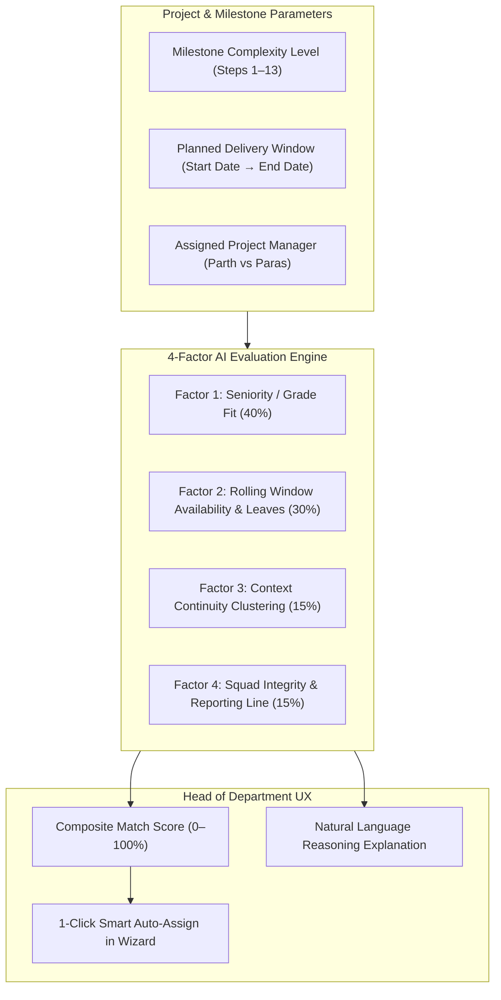
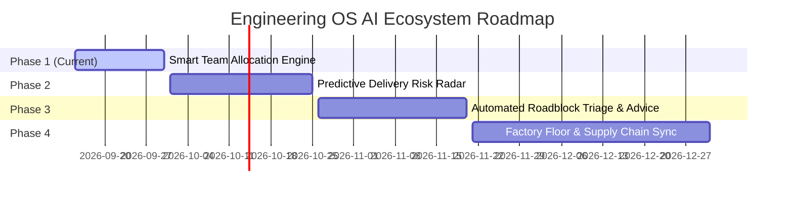

# AI-Powered Smart Team Allocation & Operations Strategy

## Executive Summary

This document defines the architecture, operational logic, and deployment strategy for integrating **Artificial Intelligence** into the **Engineering OS** Project Creation Flow for ACS Engitech.

Specifically, it establishes how the system autonomously evaluates and recommends the optimal engineering personnel for each of the **13 standardized automation project milestones** (from *IO List Preparation* to *Simulation Trial*), replacing manual guesswork and naive "least busy" shortcuts with a **Multi-Factor Operational Optimization Engine**.

---

## 1. The Core Problem: Why "Least Busy Engineer" Fails in Manufacturing

When assigning engineering tasks, naive systems simply look for whoever has the fewest recorded hours today. In industrial automation panel manufacturing, this approach creates critical operational bottlenecks:

| Naive Metric: "Least Busy" | Real-World Failure Mode at Plant / Customer Site |
| :--- | :--- |
| **Competency & Seniority Blindness** | A Trainee engineer has 0 active hours, so the system assigns them **Step 10: Safety PLC Interlocks** or **Step 13: Simulation Trial**. Result: Safety compliance failures, delayed factory acceptance tests (FAT), and expensive rework. |
| **Calendar & Site Blindness** | An engineer is completely free *today*, but has an approved 4-day leave or is booked for on-site commissioning next week when the task actually begins. |
| **Context Fragmentation (Handover Chaos)** | If Step 1 goes to Engineer A, Step 2 to B, Step 3 to C, and Step 4 to D just because they were free at that moment, engineers spend 40% of their day deciphering someone else's memory tags, IO nomenclature, and ladder routines. |
| **Squad Destruction** | Randomly scattering tasks across reporting lines undermines the leadership and accountability of **PM Parth Nagar** and **PM Paras Prajapati**. |

---

## 2. The 4-Factor Intelligent Allocation Model

The Engineering OS AI evaluates candidates across a **4-Factor Weighted Scoring Matrix (0–100)**:



### Factor 1: Seniority & Cognitive Complexity Match (Weight: 40%)
Every step in the standardized 13-task pipeline maps to an optimal engineering grade:
- **Low Complexity** (*Step 1: IO List, Step 2: Memory Mapping, Step 3: Function Block Setup*):
  - *Target*: **Trainee Engineer** or **Junior Engineer**.
  - *Rationale*: Preserves senior engineering capacity; trains upcoming talent on standardized company templates.
- **Medium Complexity** (*Steps 4–9: Sequence Logic, Alarm Routines, Interlocks, VFD/Servo Communication*):
  - *Target*: **Junior Engineer** or **Senior Engineer**.
  - *Rationale*: Requires core programming competence, syntax discipline, and vendor drive libraries.
- **High / Critical Complexity** (*Steps 10–13: Safety Interlocks, Third-Party SCADA Gateways, FAT Simulation Trial*):
  - *Target*: **Senior Engineer**, **Asst. Manager**, or **PM Technical Lead**.
  - *Rationale*: Zero-tolerance safety critical interlocks and formal client simulation sign-off.

### Factor 2: Rolling Time-Window Calendar Availability & Leaves (Weight: 30%)
- **Not Just "Today"**: The algorithm calculates the **exact planned calendar window** of the task (e.g. November 14 to November 19).
- Evaluates:
  - Active tasks scheduled across that specific date range.
  - Approved leaves in the HRMS database.
  - Planned on-site plant commissioning visits.
  - Daily capacity limit (default: 8 hours/day).
- If an engineer has less than 2.0 hours/day available during that window, a heavy capacity penalty is applied.

### Factor 3: Context Continuity & Step Clustering (Weight: 15%)
- **Anti-Fragmentation Logic**:
  - If Engineer A is assigned Step 4 (*Sequence Logic*), the AI gives Engineer A a positive affinity bonus for Step 5 (*Alarm Routines*) and Step 6 (*Interlocks*).
  - Eliminates 80% of internal handover overhead and documentation delays.

### Factor 4: Squad Integrity & PM Reporting Lines (Weight: 15%)
- If **Parth Nagar (PM 1)** is selected to lead the project:
  - Engineers directly reporting to Parth (*Shivam Prajapati, Agastya Patel, Dixit Prajapati, etc.*) are prioritized.
  - Keeps squad accountability clear and daily standups focused.
  - Cross-squad borrowing is only recommended if Parth's team is above 90% utilization.

---

## 3. The Formula: Composite Suitability Score

For any candidate $e$ and task $t$, the composite suitability score $S(e, t)$ is computed as:

$$\begin{aligned}
S(e, t) = \; & w_{\text{grade}} \cdot M_{\text{grade}}(e, t) \\
& + w_{\text{avail}} \cdot A_{\text{window}}(e, t) \\
& + w_{\text{cluster}} \cdot C_{\text{cluster}}(e, t) \\
& + w_{\text{squad}} \cdot Q_{\text{squad}}(e, t) \\
& - P_{\text{conflict}}(e, t)
\end{aligned}$$

Where:
- $M_{\text{grade}} \in [0, 100]$: Grade-to-complexity alignment (Weight: $0.40$).
- $A_{\text{window}} \in [0, 100]$: Available capacity margin between task planned start and planned end (Weight: $0.30$).
- $C_{\text{cluster}} \in [0, 100]$: Context continuity bonus if engineer owns adjacent tasks on this unit (Weight: $0.15$).
- $Q_{\text{squad}} \in [0, 100]$: Direct report to the selected Project Manager (Weight: $0.15$).
- $P_{\text{conflict}}$: Absolute disqualifier penalty (e.g., on approved leave = $-100$).

---

## 4. User Experience (UX) for Department Head (Dilip Asediya)

1. **The 1-Click Action**:
   - On the Project Creation Wizard (`/pm/projects/new`), right above the 13 sequential tasks, the Head sees:
     ```
     [ ✨ Auto-Assign Team with AI ]
     ```
2. **Instant Optimal Assignment**:
   - In $<500\text{ ms}$, all 13 dropdowns are automatically populated with the highest-scoring engineer.
3. **AI Transparent Rationale Badges**:
   - Next to each selected assignee, a badge displays the match score and human explanation:
     - **Step 1 (IO List)**: *Rishit Joshi (Jr. Engineer)* $\to$ `94% Match: Junior seniority match, 6.5h/day free during window.`
     - **Step 4 (Sequence Logic)**: *Shivam Prajapati (Sr. Engineer)* $\to$ `98% Match: Senior engineer in Parth's squad, clusters with Step 5.`
     - **Step 10 (Safety Interlocks)**: *Agastya Patel (Sr. Engineer)* $\to$ `96% Match: High complexity milestone matching Senior grade.`
     - **Step 13 (Simulation Trial)**: *Parth Nagar (PM / Lead)* $\to$ `99% Match: Final FAT simulation milestone requires Lead sign-off.`
4. **Human-in-the-Loop Override**:
   - Dilip Asediya can click any dropdown to manually override any assignment at any time. The Head remains 100% in control.

---

## 5. Future AI Ecosystem Roadmap for the Operations Dashboard

The Smart Team Allocation Engine is the foundation for an end-to-end AI Operations Suite across Engineering OS:



### Phase 2: Predictive Delivery Risk Radar (On `/dashboard`)
- Machine learning model analyzes historical completion speed across all 13 steps.
- If Step 3 is 2 days late, the AI projects the domino effect on Step 13 (FAT trial) and flags a red early warning badge 2 weeks before the client delivery date is breached.

### Phase 3: Automated Roadblock Triage & Advice
- When an engineer writes a handwritten roadblock note (e.g., *"Waiting for client GA drawing approval from Tata"*), AI reads the note:
  - Classifies the blocker (*Client Input, Vendor Component, Technical Dependency*).
  - Drafts an automated reminder email for the PM to send to the client with one click.
  - Suggests parallel non-blocked tasks the engineer can work on in the meantime.

### Phase 4: Factory Floor & Material Shortage Synchronization
- Cross-references task timelines with ERP purchase orders.
- If copper busbars or breakers are delayed at customs, AI automatically reschedules internal simulation milestones so engineers do not sit idle.

---

## Conclusion

The **AI Smart Team Allocation Engine** transforms project creation from a manual bottleneck into an instant, high-precision operational advantage. By balancing seniority, calendar availability, and squad continuity, ACS Engitech ensures maximum engineering productivity and flawless on-time project execution.
