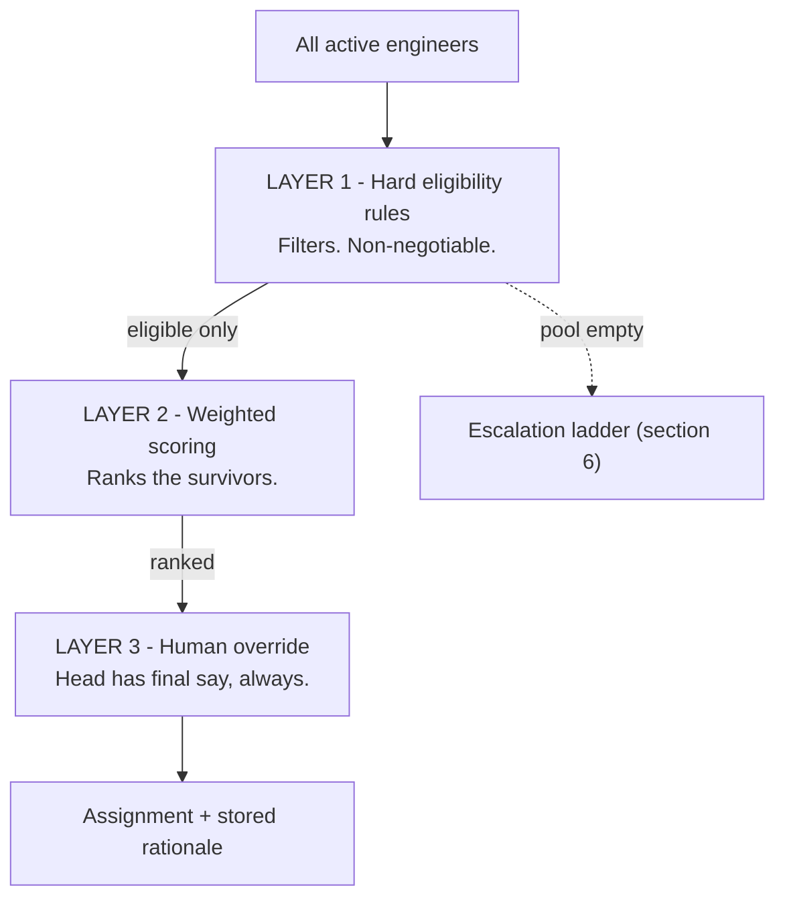
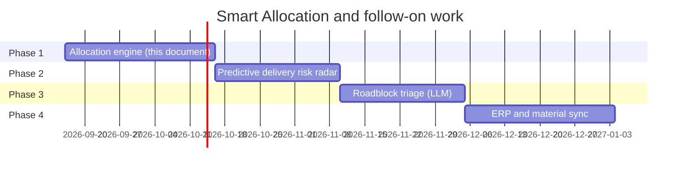

# Smart Team Allocation — Design & Implementation Specification

**Status:** design specification. **Nothing in this document is implemented yet.**
Sections marked ✅ describe code that already exists and should be reused.

**Owner decisions recorded in this document:**

| Date | Decision |
|---|---|
| 2026-09-16 | **Skills are not used** in assignment. Grade, availability, continuity and reporting line only. |
| 2026-09-16 | Selection is **deterministic scoring, not a language model.** An LLM may explain a decision; it never makes one. |
| 2026-09-16 | **Hard eligibility rules are separate from scoring.** A score can never override an eligibility rule. |

---

## 1. Why "least busy engineer" fails in panel manufacturing

Naive systems pick whoever has the fewest hours booked today. In industrial
automation that produces four specific failures:

| Naive metric | Real failure at plant / customer site |
| :--- | :--- |
| **Competency blindness** | A trainee has 0 booked hours, so they get *Step 10: Safety PLC Interlocks* or *Step 13: Simulation Trial*. Result: safety compliance failure, delayed FAT, expensive rework. |
| **Calendar blindness** | An engineer is free *today* but has approved leave, or is on site commissioning, during the week the task actually runs. |
| **Context fragmentation** | Steps 1-4 scattered across four engineers means each one re-learns someone else's memory tags, IO nomenclature and ladder routines before they can start. |
| **Squad destruction** | Scattering work across reporting lines undermines the accountability of the PM who owns delivery. |

This document specifies an engine that avoids all four **without** introducing a
fifth failure: assigning work to someone who is not qualified to do it.

---

## 2. Architecture: three layers, in this order

The single most important structural decision in this document.



**Layer 1 decides who *may* do the work. Layer 2 decides who is *best* among
them.** Collapsing these into one number is a design error — see §2.1.

### 2.1 Why the two layers cannot be merged

A weighted sum lets three good factors outvote one fatal one. Scoring a trainee
for **Step 10, Safety PLC Interlocks**, with no Layer 1:

| Candidate | Grade fit | Availability | Continuity | Squad | **Total** |
|---|---|---|---|---|---|
| **Trainee** — fully free, owns Step 9, in the PM's squad | 0.40 × 0 = 0 | 0.30 × 100 = 30 | 0.15 × 100 = 15 | 0.15 × 100 = 15 | **60** |
| **Senior Engineer** — busy, other squad, no adjacent steps | 0.40 × 100 = 40 | 0.30 × 40 = 12 | 0.15 × 0 = 0 | 0.15 × 0 = 0 | **52** |

The trainee wins, **60 to 52**, on safety-critical interlocks — exactly the
failure §1 exists to prevent.

A penalty term does not fix this. Subtracting 100 makes an ineligible person
score 0; they are still ranked, still selectable, just last. **Ineligibility must
remove a candidate from the pool, not reduce their score.**

---

## 3. Layer 1 — Hard eligibility rules

Applied as filters before any scoring. A candidate failing **any** rule is
removed from consideration for that step.

| # | Rule | Data source | Rationale |
|---|---|---|---|
| **H1** | Approved leave covering **> 50%** of the task's planned working days | `core_leaves` (`Leave` model) ✅ | They are not there |
| **H2** | Grade rank **below the step's floor** (see §3.1) | `User.grade` + template `recommendedSeniority` ✅ | Competence and safety |
| **H3** | **Zero** free hours across the planned window | computed ✅ | Cannot absorb the work |
| **H4** | Is a **Project Manager or Director** | `grade`, `designation` ✅ | Already excluded by the wizard today |
| **H5** | **Inactive** account | `User.status` ✅ | — |

> H1, H3, H4 and H5 are already computable from existing data.
> **H2 is the new rule and the one that matters most.**

### 3.1 Grade floors — using the real `Grade` enum

The Prisma enum is `TRAINEE, JUNIOR_ENGINEER, ENGINEER, SENIOR_ENGINEER,
LEAD_ENGINEER, MANAGER, HEAD, DIRECTOR`. `GRADE_RANK` in
`src/modules/project-management/domain/availability.ts` already maps these
1-8 ✅ — reuse it, do not redefine it.

Template steps carry `recommendedSeniority` ✅, already stored and already shown
in the wizard, but **currently unused for selection**. Map it:

| `recommendedSeniority` | Complexity band | Target grade (rank) | **Hard floor (rank)** |
|---|---|---|---|
| `JUNIOR` | Low — IO list, memory mapping, function blocks | JUNIOR_ENGINEER (2) | TRAINEE (1) |
| `SENIOR` | Medium/High — sequence logic, alarms, interlocks, drives | SENIOR_ENGINEER (4) | ENGINEER (3) |
| `ASST_MANAGER` | Critical — safety interlocks, SCADA gateways, FAT | LEAD_ENGINEER (5) | SENIOR_ENGINEER (4) |

**The floor is simply `target rank − 1`.** One rule, no new schema field, and it
removes the trainee from Step 10 before scoring ever runs.

> ⚠️ **`ASST_MANAGER` is not a value in the `Grade` enum.** It exists only as a
> template recommendation in `template-manager.tsx` and the wizard. Treat it as a
> *step requirement*, never as an employee grade, and relabel the UI option to
> **"Lead Engineer"** so it names a grade people can actually hold.
>
> ⚠️ **`LEAD_ENGINEER` is missing from `SENIORITY_ORDER`** in
> `automation-project-wizard.tsx` — lead engineers currently fall through to an
> unlabelled group. Add it as rank 2 in that display map.

---

## 4. Layer 2 — Weighted scoring

Applied only to candidates that survived Layer 1.

$$S(e,t) = 0.40\,M(e,t) + 0.30\,A(e,t) + 0.15\,C(e,t) + 0.15\,Q(e,t)$$

All four terms are in $[0, 100]$, so $S \in [0, 100]$. There is no penalty term —
Layer 1 replaced it.

### M — Grade fit (40%)

Asymmetric on purpose: being under-qualified is a **risk**, being over-qualified
is only **waste**.

```
rank   = GRADE_RANK[engineer.grade]
target = TARGET_RANK[step.recommendedSeniority]

if rank <  target:  M = 100 × max(0, 1 − (target − rank) / 2)   // steep
if rank >= target:  M = 100 × max(0, 1 − (rank − target) / 4)   // gentle
```

| Situation | M |
|---|---|
| Exact grade match | 100 |
| One grade over | 75 |
| Two grades over | 50 |
| One grade under (only possible at the floor) | 50 |

### A — Availability across the planned window (30%)

**Not "free today".** Uses the task's actual planned start → end.
`assignmentHoursInWindow()` and the `Workload` type already compute this ✅ —
reuse them.

```
required  = step.estimatedHours
free      = workload.freeHours              // within the task window
A         = 100 × min(1, free / (required × 1.25))

if (free / workingDaysInWindow) < 2.0:  A = A × 0.5    // thin-capacity penalty
```

The `× 1.25` means an engineer needs **25% headroom** to score full marks.
Barely-enough still scores well; wildly idle earns no extra bonus.

### C — Context continuity (15%)

Anti-fragmentation. Scoped to **one template instance within one project** — a
PLC pipeline and a SCADA pipeline on the same project do not cluster with each
other.

| Condition | C |
|---|---|
| Already owns step **n−1** or **n+1** of this template instance | 100 |
| Owns any other step of this template instance | 50 |
| Owns nothing in this template instance | 0 |

### Q — Squad integrity (15%)

```
Q = 100 if engineer.id ∈ getDescendantUserIds(selectedPmId)
Q = 0   otherwise
```

✅ **`getDescendantUserIds()` already exists** and walks the `ReportingLine`
relation (`User.managerId`) in `automation-project.service.ts`. Use it.

> **Do not** identify teams by matching names. `dashboard.service.ts` currently
> splits teams by string-matching first names — that is technical debt, not a
> pattern to copy.

---

## 5. The assignment algorithm

The part the previous draft of this document omitted, and the part that decides
whether the feature works at all.

### 5.1 Capacity must be consumed as you assign

If all steps are scored against the same snapshot, the engineer with the most
free hours wins step 1 — and is still the freest for step 2, and step 3, and
every step after. **One person is assigned the entire project.**

Assignment must therefore be **sequential**, decrementing capacity after each
pick and recomputing continuity.

```
for each template instance (PLC, SCADA, HMI) selected on the project:
    for step in 1..13:                          # ascending, never parallel
        eligible = applyHardRules(allEngineers, step)
        if eligible is empty:
            escalate(step)                      # section 6
            continue
        for e in eligible:
            score[e] = 0.40·M + 0.30·A + 0.15·C + 0.15·Q
        winner = argmax(score)                  # tie-break: section 5.2
        assign(step, winner)
        winner.freeHours -= step.estimatedHours     # ← capacity consumed
        markOwnership(winner, step)                 # ← feeds C for step+1
```

### 5.2 Deterministic tie-breaking

Equal scores must resolve the same way every run, or two clicks produce two
different teams and nobody trusts it.

1. Higher score
2. Then **lower** current utilisation percent
3. Then `employeeCode` ascending

### 5.3 Cost

39 steps (13 × 3 templates) × ~20 engineers = **≈780 evaluations**, pure
arithmetic on data already loaded for the window. In-memory, single pass, no
additional queries inside the loop.

---

## 6. Escalation when nobody is eligible

Never silently relax a safety rule. Widen in this fixed order and **record which
rung was used**:

| Rung | Relaxation | Allowed on critical steps? |
|---|---|---|
| 1 | Drop squad preference — score cross-squad candidates | ✅ Yes |
| 2 | Accept the grade **floor** instead of the target | ✅ Yes (floor already enforces safety) |
| 3 | Accept a candidate short on hours (A scores low, still eligible) | ✅ Yes |
| 4 | **Leave the step unassigned** and flag it to the Head | — |

**Rung 4 is a valid outcome.** An empty dropdown with *"No eligible engineer —
every qualified person is on leave or fully committed"* is correct, useful
information. Silently assigning someone unqualified is not.

**H1 (leave) and H2 (grade floor) are never relaxed at any rung.**

---

## 7. Edge cases the implementation must handle

| Case | Required behaviour |
|---|---|
| PM's squad smaller than the step count | Fine — capacity decrement spreads load, escalation rung 1 pulls in cross-squad help |
| Every candidate on leave | Rung 4. Flag, do not assign |
| All scores below 40 | Assign the best, but badge it **amber** with "weak match" |
| Task has no planned dates yet | A cannot be computed — fall back to current utilisation and mark the score provisional |
| Project has PLC + SCADA + HMI | **39 steps, not 13.** Each template runs its own sequential pass; C never crosses templates |
| Two steps run in parallel on the same dates | Capacity decrement handles it — the second scores lower for the same person |
| Head re-runs auto-assign | Must be **idempotent**: clear prior auto-assignments first, preserve manual overrides |

---

## 8. Permissions and audit

**Permission:** `pm.project.create` — the same key that already gates the
wizard ✅. No new permission is needed. Never branch on a role name.

**Persist the rationale.** On every auto-assignment, store:

```
compositeScore        e.g. 94
factorBreakdown       { M: 100, A: 86, C: 0, Q: 100 }
escalationRung        0 = none, 1-3 as per section 6
engineVersion         e.g. "v1-2026-09"
```

Two reasons, one immediate and one strategic:

1. **Now:** when a PM asks why an engineer was chosen — or a client asks after a
   delay — the answer is exact arithmetic, not a recollection.
2. **Later:** this is the only route to genuine learning. See §10.

---

## 9. User experience — Department Head

1. **One action.** On `/pm/projects/new`, above the step list:
   `[ Auto-assign team ]`
2. **All steps populate at once**, in one render — the engine is in-memory
   arithmetic, so there is no loading state to design around.
3. **Every assignment shows its reason**, generated from the stored factor
   breakdown:
   - *Step 1 (IO List)* → `94% · junior grade match, 6.5h/day free that week`
   - *Step 4 (Sequence Logic)* → `98% · senior in this PM's squad, follows Step 3`
   - *Step 10 (Safety Interlocks)* → `96% · senior grade required and met`
   - *Step 13 (Simulation Trial)* → `unassigned · no qualified engineer free — needs your decision`
4. **Amber badge** when the score is below 40, or when an escalation rung above 0
   was used. The Head should see where the engine had to compromise.
5. **Override anything.** Every dropdown stays editable. A manual choice is
   marked as such and survives a re-run of auto-assign.

---

## 10. Making it genuinely improve over time

This engine is deterministic arithmetic, not a learned model — which is the
correct choice today, because **there is no outcome data to learn from.**

The path to that data:

| Step | What | Effort |
|---|---|---|
| 1 | Store score + factor breakdown on every assignment (§8) | Small — do it now |
| 2 | Move the weights `0.40 / 0.30 / 0.15 / 0.15` into configuration, not constants | Small — tune without a deploy |
| 3 | Record the outcome per task: finished on time? reopened? handed over? blocked? | Small — the data already exists in `pm_tasks` and `pm_task_handovers` |
| 4 | After 6-12 months, correlate factor breakdowns against outcomes and re-fit the weights | Later |

**Step 1 is the one that is always skipped, and the only one that makes step 4
possible.** It costs almost nothing now and cannot be reconstructed later.

### Where a language model does and does not belong

| Task | Use an LLM? | Why |
|---|---|---|
| Choosing the engineer | **No** | Non-deterministic, unauditable, and the arithmetic already answers it |
| Writing the badge text from the factor breakdown | Optional | Cosmetic; a template does it for free |
| Classifying a free-text roadblock (Phase 3) | **Yes** | Genuine language work |
| Drafting the client chase email (Phase 3) | **Yes** | Genuine language work |

Staffing decisions get challenged. *"She scored 94: grade match, 6.5h/day free"*
survives a challenge. *"The AI thought she was a good fit"* does not.

---

## 11. Reconciling with the code that exists

`rankCandidates()` in `domain/availability.ts` already implements a scoring
engine with **different weights and a skills term**:

```ts
const score = Math.round(capacityScore * 60 + skillMatch * 30 + gradeScore * 10);
```

| Factor | Existing code | This specification |
|---|---|---|
| Capacity | 60% | 30% |
| **Skills** | **30%** | **removed — owner decision** |
| Grade | 10% | 40% |
| Continuity | — | 15% |
| Squad | — | 15% |
| Hard eligibility rules | none | **Layer 1** |

`gradeFit()` also keys off task **priority**, whereas this specification keys off
step **complexity** (`recommendedSeniority`). Different inputs.

**Decision required before implementation:** whether `rankCandidates` is
*replaced* by the new engine or the two coexist. Recommended: **add a new pure
function** `scoreForStep()` alongside it, leave `rankCandidates` serving the
existing ad-hoc and handover screens, and remove the skills term from both in a
separate change. Do not rewrite a tested function and change the product at the
same time.

### Skills: what becomes dormant

Per the owner decision, skills are not used in assignment. These remain in the
schema and UI but stop influencing any ranking:

- `User.skills` — still editable in People admin, still displayed on the
  resources board
- `Task.requiredSkills` — still editable, still displayed on the task page
- `skillMatch`, `matchedSkills`, `missingSkills` in `AssignmentSuggestion`

Leave the columns in place. Removing a database field to disable a feature is
irreversible; ignoring it is not.

---

## 12. Implementation checklist

In dependency order. Each item is testable on its own.

- [ ] **1.** Add `TARGET_RANK` and `gradeFloor()` to `domain/availability.ts`,
      mapping `recommendedSeniority` → target and floor per §3.1
- [ ] **2.** Add `applyHardRules(candidates, step)` — pure, unit-tested, §3
- [ ] **3.** Add `scoreForStep(engineer, step, context)` — pure, unit-tested, §4
- [ ] **4.** Add `autoAssignTeam()` in `automation-project.service.ts` —
      sequential, capacity-consuming, §5. Assert `pm.project.create` first
- [ ] **5.** Escalation ladder + rung recording, §6
- [ ] **6.** Persist `compositeScore`, `factorBreakdown`, `escalationRung`,
      `engineVersion` (needs a migration)
- [ ] **7.** Wire `[ Auto-assign team ]` into `automation-project-wizard.tsx`, §9
- [ ] **8.** Add `LEAD_ENGINEER` to `SENIORITY_ORDER`; relabel `ASST_MANAGER` →
      "Lead Engineer" in `template-manager.tsx`
- [ ] **9.** Move weights into configuration, §10 step 2

**Unit tests are mandatory for items 1-3** — they are pure functions in
`domain/`, which per `CLAUDE.md` is exactly where testable logic belongs.

### Acceptance tests

- [ ] A trainee is **never** returned as eligible for a `SENIOR` or
      `ASST_MANAGER` step, regardless of availability
- [ ] Auto-assigning a 13-step project does **not** give every step to one person
- [ ] Running auto-assign twice on the same project produces the **same** team
- [ ] An engineer on approved leave across the window is never assigned
- [ ] A project with PLC + SCADA + HMI assigns **39** steps, and continuity does
      not cross templates
- [ ] When no one is eligible, the step is left **unassigned and flagged** — not
      given to the least-bad candidate
- [ ] Re-running auto-assign preserves manual overrides

---

## 13. Roadmap



**Phase 2 — Predictive delivery risk.** Once §10 step 3 is collecting outcomes,
project the effect of a late step on the FAT date and warn before the client
deadline is breached. Statistical, not learned, until there is enough history.

**Phase 3 — Roadblock triage.** The first place a language model genuinely earns
its keep: read *"waiting for client GA drawing approval from Tata"*, classify it
(client input / vendor / technical dependency), draft the chase email, and
suggest unblocked work in the meantime.

**Phase 4 — ERP and material sync.** Cross-reference task timelines with purchase
orders so a delayed busbar shipment reschedules simulation milestones instead of
leaving engineers idle.

---

## Summary

The engine avoids the four failures in §1 by scoring grade fit, window
availability, context continuity and squad integrity — and avoids creating a
fifth by putting **hard eligibility rules in front of the scoring**, where a
weighted average cannot outvote them.

It is deterministic, explainable, and cheap. It will not be *perfect*; it will be
consistently better than assigning 39 tasks by hand at the end of a long day, and
every decision it makes can be defended with arithmetic.
