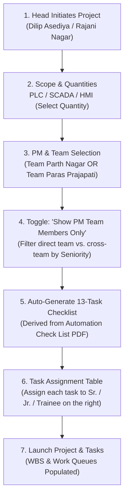

# Automation Project Creation Flow (Department Head)

This document defines the end-to-end business logic, user experience, and technical architecture for project creation by the **Head of Technical** (*Dilipkumar Rameshbhai Asediya*) and **Head of Service** (*Rajani Bhurabhai Nagar*) at ACS Engitech Pvt Ltd.

---

## 1. Executive Summary & Initiators

In ACS Engitech's automation and switchgear panel manufacturing operations, projects originate when a customer contract or purchase order is confirmed. Only designated Department Heads possess the authority to initiate new automation projects:

- **Dilipkumar Rameshbhai Asediya** — *Head of Technical & Project Management*
- **Rajani Bhurabhai Nagar** — *Head of Service*



---

## 2. Step-by-Step Flow

### Step 1: Project Basics & Scope Selection

The Head begins by entering basic commercial and scheduling parameters:
- **Project Name** (e.g. *Tata Chemicals - Demineralized Water Automation System*)
- **Client Name** (e.g. *Tata Chemicals Ltd*)
- **Project Code** (Auto-generated or custom, e.g. *ACS-PRJ-2026-004*)
- **Target Delivery Date / Milestones**
- **Customer PO Number & Order Value**

#### Scope Package Selection with Quantities
The Head selects which of the 3 primary automation packages are in the contract scope and enters the **Quantity** (number of systems/panels):

| Scope Package | In Scope? | Quantity (Units) | Description |
| :--- | :---: | :---: | :--- |
| **PLC Programming + Simulation** | `[x]` | `[ 2 ] PLCs` | Complete PLC logic, I/O mapping, PID, sequencing, simulation |
| **SCADA Programming + Simulation** | `[x]` | `[ 1 ] Station` | PC-based SCADA runtime, screens, alarms, trends, database |
| **HMI Programming + Simulation** | `[ ]` | `[ 0 ] HMIs` | Touch panel operator interface screens, faceplates, diagnostics |

> **Note**: Specifying the quantity of PLCs allows the system to generate dedicated checklist blocks per PLC (e.g. *PLC 1 - Reactor Area*, *PLC 2 - Utilities Area*).

---

### Step 2: Project Manager & Team Selection

ACS Engitech has two primary automation project delivery teams headed by dedicated Project Managers:

#### Team Template 1: PM Parth Dasharathbhai Nagar
- **Project Manager**: Parth Dasharathbhai Nagar
- **Assistant Manager**: Dhrupin Vithalbhai Vaghasiya
- **Senior Engineers**:
  - Shivam Bipinchandra Prajapati
  - Agastya Dilipbhai Patel
  - Dixit Prajapati
  - Yogi Bharatbhai Patel
- **Junior Engineers**:
  - Sahil Dipakbhai Patil
  - Abbasali Mahamadali Sunasara
  - Het Harshadbhai Patel
  - Anurag Sohandas Vaishnav
- **Trainee Engineer**:
  - Jigar Girishbhai Nayak

#### Team Template 2: PM Paras Rajendrakumar Prajapati
- **Project Manager**: Paras Rajendrakumar Prajapati
- **Assistant Manager**: Munaf Anavarbhai Multani
- **Senior Engineers**:
  - Ridhhi Kiranbhai Patel
  - Harsh Ajaybhai Suthar
  - Chirag Rameshbhai Prajapati
  - Hitesh Rameshbhai Malviya
  - Krupesh Bhikhbhai Solanki
- **Junior Engineer**:
  - Harmitsinh Udavat
- **Trainee Engineers**:
  - Ashish Dinkar Hajare
  - Tejas Yogesh Rokade

---

### Step 3: Team Filtering & Cross-Assignment Toggle

When the Head selects the Project Manager (e.g., *Parth Nagar*), the UI presents a checkbox toggle:

> `[x] Show PM team members only` *(Checked by default)*

1. **When Checked**:
   - Only members belonging to the chosen PM's direct team appear in the task assignment dropdowns.
   - Prevents accidental assignment of engineers dedicated to other projects.

2. **When Unchecked (Cross-Team Flexibility)**:
   - The Head can borrow or cross-assign engineers from the other PM's team or the wider technical department.
   - The dropdown groups and sorts all available technical personnel by **Seniority Level**:
     - **Level 1: Assistant Managers** *(Dhrupin Vaghasiya, Munaf Multani)*
     - **Level 2: Senior Engineers** *(Agastya Patel, Shivam Prajapati, Ridhhi Patel, etc.)*
     - **Level 3: Junior Engineers** *(Sahil Patil, Abbasali Sunasara, Harmitsinh Udavat, etc.)*
     - **Level 4: Trainee Engineers** *(Jigar Nayak, Ashish Hajare, Tejas Rokade)*

---

### Step 4: The 13 Sequential Steps & Blocker Dependencies

Upon confirming the scope (e.g., *PLC Programming + Simulation*), the system generates an ordered step-by-step pipeline from **Step 1 to Step 13** derived directly from `Automation Check List.pdf`.

#### Sequential Pipeline & Blocker Rules
- **Step Ordering**: Tasks follow a strict sequential engineering workflow starting with **Step 1: Review Control Philosophy / Functional Requirements** and culminating in **Step 13: Simulation with Auto Sequence Trial and SCADA / HMI**.
- **Task Blocking (`BLOCKED` Status)**:
  - A task cannot be started if its prerequisite/predecessor tasks are still pending.
  - **Simulation Trial Blocker**: Step 12 & Step 13 (*Simulation Trial*) are strictly **BLOCKED** until all prior configuration, I/O mapping, PID, and control logic tasks are completed.
  - The Head can configure custom blockers (e.g., *Step 8 PID Logic blocked by Step 7 Analog Scaling*).
  - Blocked tasks appear in engineers' queues with a `[BLOCKED]` badge indicating exactly which pending task is holding it up.

#### Exclusive Editing Access (Directors & Department Heads Only)
- **Role-Gated Template & Task Editing**:
  - **Only Directors** (*Satish Nagar, Bhavesh Prajapati, Shaktikumar Vasava*) and **Department Heads** (*Dilip Asediya, Rajani Nagar*) have permission to:
    - Add new subtasks or remove existing subtasks.
    - Reorder steps in the pipeline.
    - Create new main scope categories / templates.
    - Modify default blocker rules and dependencies.
  - Project Managers and Engineers cannot alter the approved checklist structure, guaranteeing quality compliance across all client deliveries.

| Step # | Standard Task Name | Typical Seniority | Default Blocker | Assignee (Right Dropdown) |
| :-: | :--- | :---: | :--- | :--- |
| **Step 1** | Review Control Philosophy / Functional Requirements | Senior | None (Start) | `[ Select Engineer ▼ ]` |
| **Step 2** | Verify I/O List and Tag List as per Approved Documents | Junior / Trainee | Step 1 | `[ Select Engineer ▼ ]` |
| **Step 3** | Verify PLC Hardware Configuration as per Electrical Dwg | Junior / Senior | Step 2 | `[ Select Engineer ▼ ]` |
| **Step 4** | Verify PLC CPU, Comm Modules & Network Configuration | Senior | Step 3 | `[ Select Engineer ▼ ]` |
| **Step 5** | DI Mapping | Junior / Trainee | Step 2, Step 4 | `[ Select Engineer ▼ ]` |
| **Step 6** | DQ Mapping | Junior / Trainee | Step 2, Step 4 | `[ Select Engineer ▼ ]` |
| **Step 7** | Analog Input Scaling, Engineering Units & Range Settings | Junior / Senior | Step 5, Step 6 | `[ Select Engineer ▼ ]` |
| **Step 8** | Analog Output / PID Control Logic | Senior | Step 7 | `[ Select Engineer ▼ ]` |
| **Step 9** | Motor Control Logic, Faceplate, Alarms & Animation | Senior | Step 5, Step 6 | `[ Select Engineer ▼ ]` |
| **Step 10** | Valve Control Logic, Faceplate, Alarms & Animation | Senior | Step 5, Step 6 | `[ Select Engineer ▼ ]` |
| **Step 11** | Auto Sequence Complete | Senior | Steps 8, 9, 10 | `[ Select Engineer ▼ ]` |
| **Step 12** | Simulation Trial of Manual Function | Junior / Senior | Step 11 | `[ Select Engineer ▼ ]` |
| **Step 13** | Simulation with Auto Sequence Trial and SCADA / HMI | Senior / PM | **All Steps (1-12)** | `[ Select Engineer ▼ ]` |

#### Additional Checklists (Generated when SCADA / HMI are selected)
If SCADA or HMI are in scope, matching 13-task tables are generated:
- *1. Review P&ID and requirement*
- *2. Diagnostic Screen of DI*
- *3. Diagnostic Screen of DQ*
- *4. Diagnostic Screen of AI*
- *5. Diagnostic Screen of AQ*
- *6. Scaling Screen of Analog parameter*
- *7. Faceplate Development*
- *8. Alarm + History development*
- *9. Trend development*
- *10. P&ID Developed without tag*
- *11. P&ID developed with Tag Complete*
- *12. Communication Architect*
- *13. Simulation Trial*

#### Simulation Detail Checklist (22 Detailed Verification Points)
During the simulation phase (Tasks 12 & 13), the team validates the 22 standardized checkpoints:
1. Simulate all Digital Inputs and verify indication
2. Simulate all Digital Outputs and verify status
3. Simulate Analog Inputs (Present Value, mA, engineering units)
4. Verify Analog Alarms (High, High-High, Low, Low-Low) & bypass
5. Simulate Analog Outputs and verify count/value
6. Verify Motor Start/Stop, interlocks, and fault conditions
7. Verify Motor faceplate, alarms, and animation
8. Verify Valve Open/Close, interlocks, and fault conditions
9. Verify Valve faceplate, alarms, and animation
10. Verify PID Auto/Manual operation and PID action
11. Verify P/I/D gains, Auto Setpoint, and Manual Setpoint
12. Verify Flow Totalizer and Reset button
13. Verify Active Alarm generation and Acknowledge function
14. Verify Historical Alarm recording and password-protected reset
15. Verify Trends and historical data logging
16. Verify PLC-HMI / SCADA communication link
17. Verify Modbus RS485 / Modbus TCP/IP communication
18. Verify PROFINET / PROFIBUS / GET-PUT communication
19. Verify DCS / Third-Party data exchange
20. Verify Data Logger operation
21. Verify power cycle / restart behavior and retentive parameters
22. Verify system initialization after cold/warm restart

---

### Step 5: Creation & Automatic Distribution

Once the Head confirms assignments:
1. The project record is created with status `PLANNING`.
2. The chosen PM receives ownership and full project management permissions.
3. Project members are registered in the project roster.
4. The 13 tasks (per unit) are inserted into the Work Breakdown Structure (WBS).
5. Individual task cards appear on each assigned engineer's **"My Work"** queue (`/pm/my-work`).

---

## 3. Screen Layout Wireframe

```
+---------------------------------------------------------------------------------------------------+
| Define New Automation Project                                                                     |
+---------------------------------------------------------------------------------------------------+
| 1. Order & Client Details                                                                         |
|    Project Name: [ Tata Chemicals - Demineralized Water Automation System                       ] |
|    Client:       [ Tata Chemicals Ltd             ]  Target Delivery: [ 2026-11-15 ]             |
|    Project Code: [ ACS-PRJ-004                    ]  PO Number:       [ PO-TC-8891 ]             |
+---------------------------------------------------------------------------------------------------+
| 2. Automation Scope & Quantities                                                                  |
|    [X] PLC Programming + Simulation   | Quantity: [ 2 ] PLCs                                      |
|    [X] SCADA Programming + Simulation | Quantity: [ 1 ] Station                                   |
|    [ ] HMI Programming + Simulation   | Quantity: [ 0 ] Panels                                    |
+---------------------------------------------------------------------------------------------------+
| 3. Team Leadership                                                                                |
|    Project Manager: [ Parth Dasharathbhai Nagar ▼ ]                                               |
|    [X] Show PM team members only                                                                  |
+---------------------------------------------------------------------------------------------------+
| 4. Task Breakdown: PLC 1 (13 Tasks)                                                               |
|    TASK NAME                                                    SENIORITY   ASSIGNEE              |
|    1. Review Control Philosophy / Functional Requirements       Senior      [ Shivam Prajapati ▼] |
|    2. Verify I/O List and Tag List as per Approved Documents    Junior      [ Sahil Patil      ▼] |
|    3. Verify PLC Hardware Configuration as per Electrical Dwg   Junior      [ Abbasali Sunasara▼] |
|    ...                                                          ...         ...                   |
|    13. Simulation with Auto sequence trial and SCADA/HMI        Senior      [ Agastya Patel    ▼] |
+---------------------------------------------------------------------------------------------------+
|                                                               [ Cancel ]  [ Create Project & Tasks ]|
+---------------------------------------------------------------------------------------------------+
```

---

## 4. Project Manager (PM) Operational Model

Once the Department Head initiates the project and sets the initial timeline and assignments, the Project Manager (*Parth Nagar* or *Paras Prajapati*) manages active execution:

### 1. Timelines & Durations (Committed by Head)
- The planned start and end dates (and durations in days) for each of the 13 tasks are **set by the Department Head** during project creation.
- The PM executes against the timeline committed by the Head.

### 2. Flexible Reassignment & Handovers
- **Cross-Team Task Assignment**: The PM can reassign any of the 13 tasks within their team, or pull in an engineer from another team/department if someone is on leave or overloaded.
- **Whole Project Handover**: A PM can handover the entire project to another PM (e.g. *Parth Nagar handing over to Paras Prajapati*).
- **Engineer-to-Engineer Handover**: An assigned engineer can also initiate a handover of their own task to a peer if they need assistance.

### 3. Progress Tracking (No Hourly Bureaucracy)
- Engineers **do NOT log daily hours**.
- Engineers log **Progress Percentage (%)** (e.g. *25%, 50%, 75%, 100%*) and descriptive technical progress notes on what was completed.

### 4. Two-Stage Task Completion (PM Review Gate)
- When an engineer finishes their task:
  1. The task moves to status **`IN_REVIEW`** (Pending PM Review).
  2. The PM inspects the engineering deliverables (I/O map, ladder logic, function blocks, HMI screens).
  3. The PM either:
     - **Approves**: Task transitions officially to **`COMPLETED`**.
     - **Disapproves / Rejects**: Task is returned to the engineer with corrective feedback notes.

---

## 5. Strict Blocker Enforcement & Auto-Unlocking

```
[ Step 1 (Philosophy) ] --(Approved)--> [ Step 2 (I/O List) Unlocks: BLOCKED -> TODO ]
```

1. **Strict Starting & Completion Guardrail**:
   - An engineer **cannot start** and **cannot complete** a task if any prerequisite blocker task is still pending or incomplete.
2. **Auto-Unlocking**:
   - As soon as the PM approves a predecessor task, the system **automatically unlocks** the successor task from **`BLOCKED`** to **`TODO`**, sending a real-time notification to the assigned engineer.
3. **Simulation Blocker Rule**:
   - Step 12 & Step 13 (*Simulation Trial*) are strictly **BLOCKED** until all prior configuration, I/O mapping, PID, and control logic tasks have been fully completed and approved by the PM.

---

## 6. Roadblock Flagging (Mandatory Custom Notes)

If an engineer is blocked by external dependencies (e.g. *waiting for client drawings, unanswered technical queries, missing vendor GSD files, hardware unavailability*):
- The engineer clicks **Flag Task**.
- **No Generic Dropdown Slop**: The system bans generic boilerplate options like *"Other"* or *"Internal delay"*.
- **Mandatory Custom Explanation**: The engineer must type their own specific, real-world comment describing the exact roadblock.
- The flag displays as an attention-grabbing alert on the PM, Head, and Director dashboards, triggering management intervention with the client.

---

## 7. Downward Visibility & Upward Isolation Matrix

The platform strictly enforces the **Downward Visibility & Upward Isolation** principle across all screens:

| Role Level | Who | Downward Visibility (What They Can See) | Upward Isolation (What Is Blocked) |
| :--- | :--- | :--- | :--- |
| **Level 1: Directors** | *Satish Nagar, Bhavesh Prajapati, Shaktikumar Vasava* | **Company-Wide (Everything)**: All projects, all tasks, all PMs, all engineers, commercial order values, audit trails, system configuration. | *No restrictions.* Full executive governance. |
| **Level 2: Department Heads** | *Dilipkumar Asediya, Rajani Bhurabhai Nagar* | **Department-Wide**: All department projects, all PMs, all engineers, project creation wizard, master checklist templates, schedule dates, blocker rules, live progress. | Platform-wide user password administration, company financial accounting settings. |
| **Level 3: Project Managers** | *Parth Nagar, Paras Prajapati* | **Project-Wide**: All work in assigned projects, task assignments, progress logs, task reviews/approvals, roadblocks/flags, team workload. | Administration menus (People & Access, Roles & Permissions, Audit Trail), editing master checklist templates. |
| **Level 4: Engineers** *(Sr., Jr., Trainee)* | *Shivam, Agastya, Sahil, Abbasali, Jigar, etc.* | **Task-Focused**: Assigned tasks in **"My Work"**, checklist descriptions, task blockers, personal progress updates. | Management settings, commercial financial figures (PO values, profit margins), project creation, master templates. |

---

## 8. Final Step & Project Completion Confirmation Gate

When the Project Manager reviews and **Approves** the final milestone task (Step 13: Simulation Trial):
1. **Automated Completeness Check**:
   - The system scans the entire project WBS to verify that 100% of all assigned tasks are in status `COMPLETED`.
2. **Interactive PM Confirmation Prompt**:
   - The system opens a clean modal prompt:
     > **"All tasks on this project are completed! Would you like to mark the project as Completed as well?"**
     > `[ Yes, Mark Project Completed ]` &nbsp;&nbsp;&nbsp;&nbsp; `[ Not Yet ]`
   - Choosing **"Not Yet"** keeps the project active so the PM can perform additional inspections, final code checks, or team discussions.
3. **Automated Head Notification**:
   - When the PM clicks **"Yes, Mark Project Completed"**:
     - The project status moves to **`COMPLETED`**.
     - An instant automated notification is sent directly to the **Department Head** (*Dilip Asediya* / *Rajani Nagar*):
       > *"Project [ACS-PRJ-XXX] has been completed by PM [Parth Nagar] and is ready for your review."*

---

## 9. Scope Changes & Mid-Flight Additions (Ad-Hoc Tasks)

- **No File Storage / Uploads**: In line with minimalist engineering principles, file uploads and document archives are omitted. The system focuses entirely on real-time task execution, progress %, and blocker resolution.
- **Handling Client Scope Changes**: If the customer adds new I/O points, revisions, or hardware mid-project, the PM or Department Head simply clicks **"Assign ad-hoc work"** or adds an extra task to the project.

---

## 10. Comprehensive Executive Live Dashboard

Higher management (*Directors and Department Heads*) have access to a real-time, consolidated live dashboard answering the three vital business questions at a single glance:
1. **What is going on with every project?** (Live status, % completed, target delivery dates vs. current pace).
2. **Who is doing what right now?** (Current active tasks, assigned engineers, capacity load).
3. **What blockers exist today?** (Consolidated view of all flagged roadblocks across all jobs, displaying the engineer's handwritten comment so leadership can intervene immediately).


